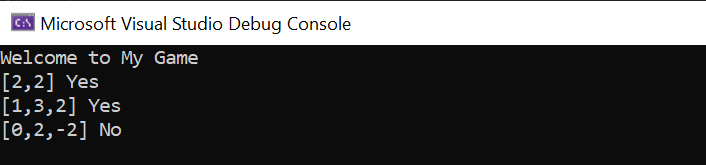
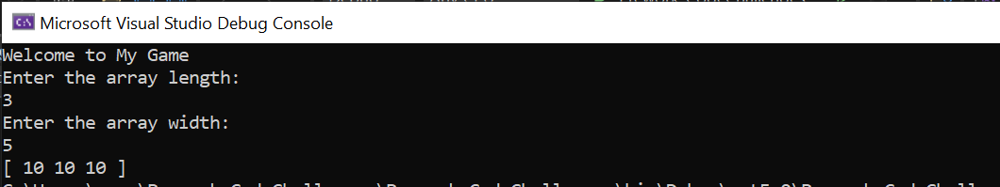

# Prework-CodeChallenges
## Array Max Result
1. Run my code.
2. Enter 5 Numbers between 1-10.
3. Enter a Number from the Array.
4. Score: Your Number * frequency.

 

 

 

## Leap Year Calculator
1. Run my code.
2. Enter a Year to check if it is a Leap Year.

 

 

 

## Perfect Sequence
1. Run my code.
2. See What is Perfect Sequence and What is Not.

 

 

 

## Sum of Rows
1. Run my code.
2. Enter the Array Length.
3. Enter the Array Width.

 

